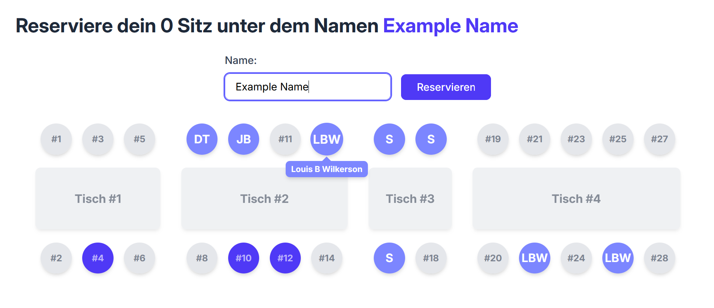

# Simple Table Reservation

A minimalistic table reservation system built with Svelte and SvelteKit. This app allows users to reserve seats at tables in a simple, trust-based environment—ideal for small groups or events where authentication isn't needed.



## Features
- Maintainer-defined table and seat setup
- Users can reserve seats by name
- Reserved seats are locked and cannot be taken again
- Names will be displayed publicly

## Setup Instructions

### 1. Clone the Repository

```bash
git clone https://github.com/W4hr/simple-table-reservation.git
cd simple-table-reservation
````

### 2. Install Dependencies

```bash
npm install
```

### 3. Initialize the Database

The maintainer must define the table/seat structure manually.

* In `seat.js`, edit the list to reflect your table and seat layout.

  * The length of the list = number of tables
  * Each number in the list = number of seats at that table
  * Example: `[4, 6, 2]` creates 3 tables with 4, 6, and 2 seats respectively

Then run:

```bash
node db.js
node seat.js
```

### 4. Run the App Locally

```bash
npm run dev
```

Then open [http://localhost:5173](http://localhost:5173) in your browser.

## Future Plans

* Docker support
* Deployment configuration

## License

This project is licensed under the [MIT License](LICENSE).