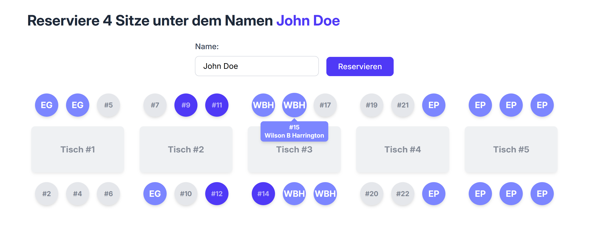

# Simple Table Reservation

A minimalistic table reservation system built with Svelte and SvelteKit. This app allows users to reserve seats at tables in a simple, trust-based environment—ideal for small groups or events where authentication isn't needed.



> **Note**: Cross-origin request checks are currently disabled for easier development and usage across environments.

## Features

* Maintainer-defined table and seat setup
* Users can reserve seats by name
* Reserved seats are locked and cannot be taken again
* Names will be displayed publicly

## Setup Instructions

### 1. Clone the Repository

```bash
git clone https://github.com/W4hr/simple-table-reservation.git
cd simple-table-reservation
```

### 2. Install Dependencies

```bash
npm install
```

### 3. Initialize the Database

The maintainer must define the table/seat structure manually.

* In `seat.js`, edit the list to reflect your table and seat layout.

  * The length of the list = number of tables
  * Each number in the list = number of seats at that table
  * Example: `[4, 6, 2]` creates 3 tables with 4, 6, and 2 seats respectively

Then run:

```bash
node seat.js
```

### 4. Set Environment Variable

Create a `.env` file in the project root and add the following line:

```bash
NODE_ENV=development
```

This ensures the app runs in development mode when using `node`.

### 5. Run the App Locally

```bash
npm run dev
```

Then open [http://localhost:5173](http://localhost:5173) in your browser.

## Docker Deployment

You can also deploy the app using Docker:

1. **Build the Docker image:**

   ```bash
   docker build -t simple-table-reservation .
   ```

2. **Run the container with your desired table configuration:**

   ```bash
   docker run -p 3000:3000 \
      -e TABLE_LIST='[6,8,4,10]' \
      -v /path/to/your/database.db:/app/data/database.db \
      simple-table-reservation
   ```

   This example sets up four tables with 6, 8, 4, and 10 seats respectively. <br>
   **To start with a fresh database**, simply omit the volume flag:

   ```bash
   docker run -p 3000:3000 -e TABLE_LIST='[6,8,4,10]' simple-table-reservation
   ```

3. **Access the app** at [http://localhost:3000](http://localhost:3000).

> Note: The `TABLE_LIST` environment variable should be a JSON array representing your table layout.

## Future Plans

* Docker support ✅
* Deployment configuration (✅)
* administration interface
* add logging

## License

This project is licensed under the [MIT License](LICENSE).